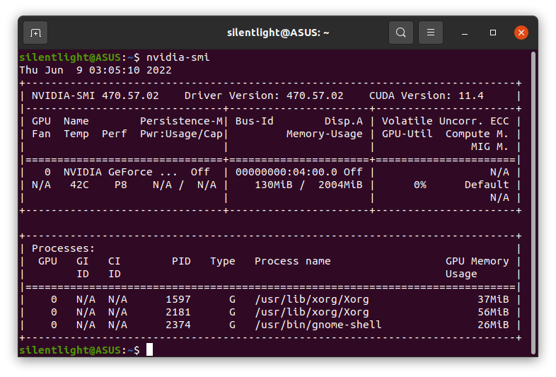
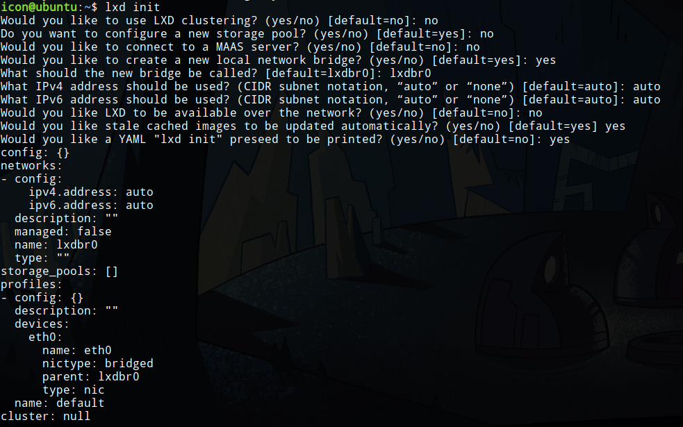
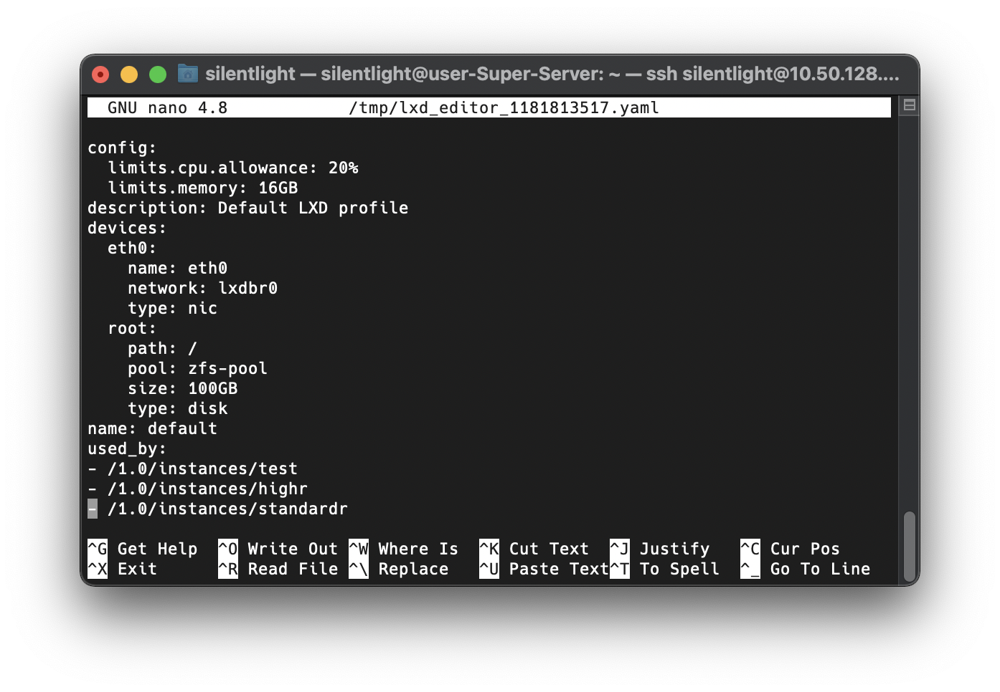

# GPU服务器搭建过程

## 更新系统

因为 ```Ubuntu 16.04``` 安装的 ```LXD``` 版本太低(2.0)，添加不了 GPU，同时为了以后考虑，将系统更新到了 20.04 版本。为什么不更新到最新的 22.04 呢，因为 22.04 刚出不久，还是 20.04 比较稳定。


由于 Ubuntu 更新只能向上更新一级，即现在的 16.04 升级到 18.04，这里采用了重装系统的方式，直接一步到位升级到了 20.04。如果后续需要更新系统，直接用命令更新即可。更新系统前建议备份重要的数据，以防丢失。

## 显卡驱动安装

直接安装```软件与更新```里面的显卡驱动即可，简单方便。注意：不要安装以 server 结尾的那些。


然后使用 ```nvidia-smi``` 命令,查看是否安装成功。



## LXD安装与配置

> 搭建方案：https://github.com/shenuiuin/LXD_GPU_SERVER

1. 安装LXD

   ```shell
   sudo apt-get install lxd zfsutils-linux bridge-utils
   ```

2. 配置ZFS

   由于硬盘空间已经全部分好区，因此我们先利用 ```Gparted``` 从机械硬盘的 `/dev/sdb1` 分区上划出了 1T 空间用作容器的存储卷，分区号为 ```/dev/sdb2```。

   然后，在这个空白分区上创建一个 ```ZFS``` 存储池:

   ```shell
   sudo lxc storage create zfs-pool zfs source=/dev/sdb2
   ```

3. LXD初始化

   ```shell
   sudo lxd init
   ```

   

4. 配置容器默认参数

   ```shell
   sudo lxc profile edit default
   ```

   设置默认参数后，新创建的容器都会继承默认参数。我们可以在此限制 CPU、内存、硬盘等资源：

   

   ## 创建容器

   1. 利用清华源镜像创建容器

      ```shell
      sudo lxc remote add tuna-images https://mirrors.tuna.tsinghua.edu.cn/lxc-images/ --protocol=simplestreams --public
      
      sudo lxc launch tuna-images:ubuntu/20.04 test
      ```

   2. 进入容器并修改密码

      ```shell
      sudo lxc exec test bash
      
      passwd root
      passwd ubuntu
      ```

      容器内默认存在一个名为 ```ubuntu``` 的用户

   3. 安装 ```ssh``` 服务

      ```shell
      apt install ssh
      ```

   4. 退出容器回到宿主机

      ```shell
      exit
      ```

   5. 配置端口转发

      ```shell
      sudo lxc config device add test proxy0 proxy listen=tcp:10.50.128.65:60601 connect=tcp:10.251.10.227:22 bind=host
      ```

      其中```10.50.128.65``` 是宿主机的固定IP，并通过宿主机的端口号 ```60601``` 监听容器的 SSH 默认端口 ```22``` 。```10.251.10.227``` 是容器的内部IP 地址，可通过 ```sudo lxc list``` 查看。

   ## 容器配置

   1. 连接容器

      ```shell
      ssh ubuntu@10.50.128.65 -p 60601
      ```

   2. 更换软件安装源

      ```shell
      sudo vim /etc/apt/sources.list
      ```

      添加网易源（仅对 20.04 系统有效）：

      ```
      deb http://mirrors.163.com/ubuntu/ focal main restricted universe multiverse
      deb http://mirrors.163.com/ubuntu/ focal-security main restricted universe multiverse
      deb http://mirrors.163.com/ubuntu/ focal-updates main restricted universe multiverse
      deb http://mirrors.163.com/ubuntu/ focal-backports main restricted universe multiverse
      deb-src http://mirrors.163.com/ubuntu/ focal main restricted universe multiverse
      deb-src http://mirrors.163.com/ubuntu/ focal-security main restricted universe multiverse
      deb-src http://mirrors.163.com/ubuntu/ focal-updates main restricted universe multiverse
      deb-src http://mirrors.163.com/ubuntu/ focal-backports main restricted universe multiverse
      ```

   3. 为容器分配显卡

      ```shell
      lxc config device add test gpu0 gpu pci=0000:18:00.0
      ```

      起初通过显卡ID来进行分配，但分配到了所有的显卡。而通过显卡的 PCI-ID 区分，则可达到分配的目的。每张显卡的 PCI-ID 可通过 `nvidia-smi` 命令查看。

   4. 安装显卡驱动

      ```shell
      wget https://cn.download.nvidia.com/XFree86/Linux-x86_64/470.129.06/NVIDIA-Linux-x86_64-470.129.06.run
      # 无需安装到内核
      sudo sh ./NVIDIA-Linux-x86_64-470.129.06.run --no-kernel-module
      ```

   ## 容器模板

   将之前做好的 test 容器保存为镜像

   1. 停止容器

      ```shell
      sudo lxc stop test
      ```

   2. 保存为镜像

      ```shell
      sudo lxc publish test --alias standardr --public
      ```

      