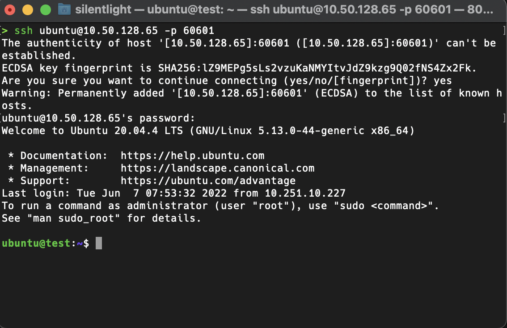
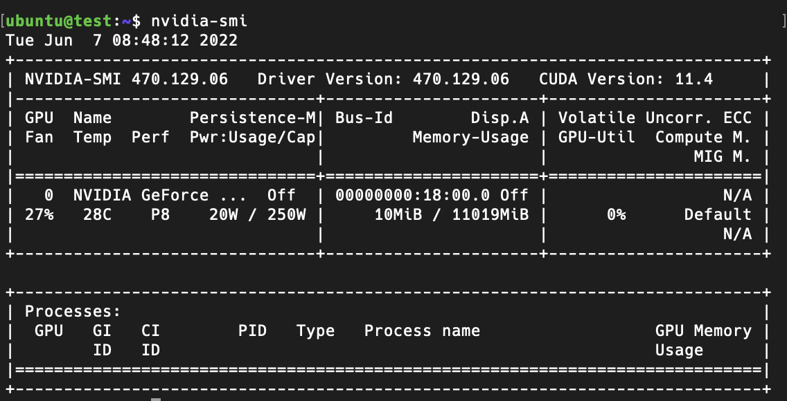
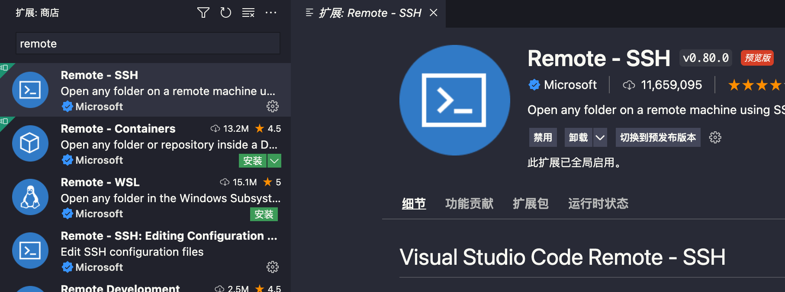
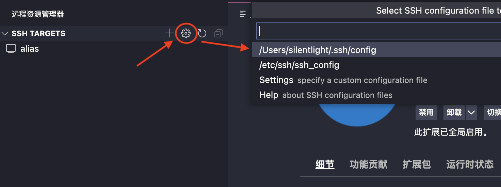
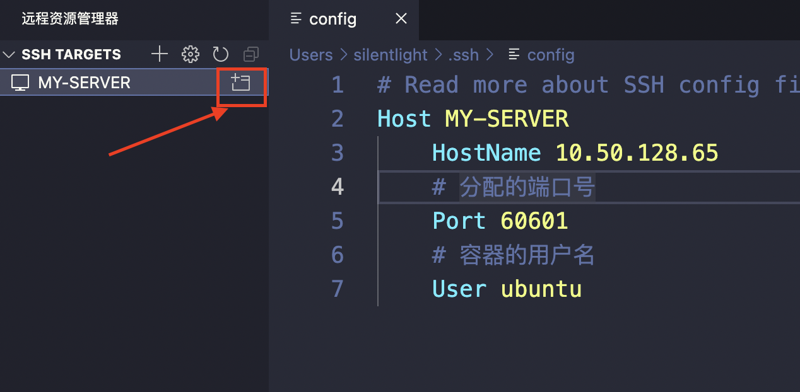
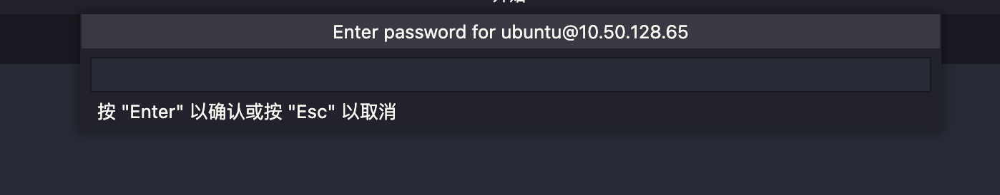
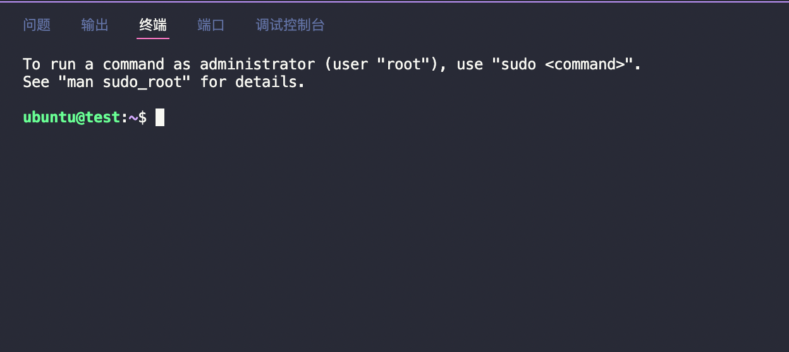
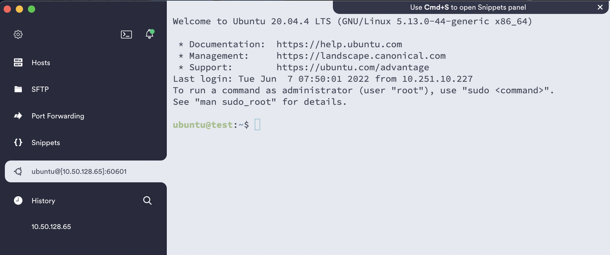
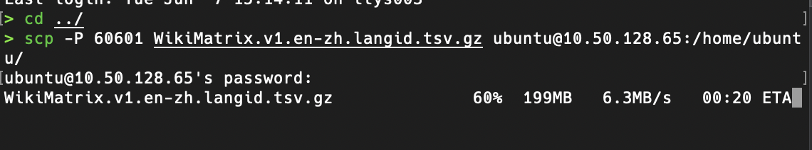

# 用户使用手册

::: warning 使用前必读
1. 禁止在上面挖矿，一旦发现即刻销毁容器！

2. 仅限内部使用，禁止分享给外部人员使用！

3. 仅限校内登录校园网使用！

4. 如果需要更多的资源，请先与老师沟通！
4. 不要卸载重装容器内的显卡驱动，不要升级系统内核！
4. 在使用的过程中遇到问题，可随时联系管理员

:::

## 默认环境

| 参数名   | 参数值          |
| -------- | :-------------- |
| 系统     | Ubuntu 20.04LTS |
| 显卡驱动 | 470.129.06      |
| GPU      | 1张             |
| CPU      | 20%             |
| 内存     | 16G             |
| 硬盘     | 100G            |

## SSH远程连接

### 默认终端

1. 打开系统的默认终端，Windows 下可以使用 ```Windows terminal```

   如果提示 ```ssh``` 未安装，需要先安装 ```ssh``` 服务。

2. 使用 ```ssh``` 命令进行远程连接

   ```shell
   ssh ubuntu@10.50.128.65 -p <port number>
   ```

   - ```ubuntu``` 是每个容器内默认的用户名，默认密码是 123456。

   - ```10.50.128.65``` 是实验室服务器主机的**固定IP**
   - ```<port number>``` 是分配给你的端口号

   终端输出以下信息说明已登录成功

   

3. 修改密码

   因为容器的默认密码都是 123456，所以首次连接上后第一件事就是修改密码

   ```shell
   passwd root
   passwd ubuntu
   ```

4. 查看GPU信息

   容器内已经默认安装好了显卡驱动，键入命令 ```nvidia-smi``` 后，可以看到 ```test``` 容器已经分配好了一张卡

   

### VS Code

这部分写给平时喜欢用 VS Code 的同学参考，其他同学可直接跳过，用默认终端连接即可

1. 安装 ```Remote-SSH``` 插件

   

2. 编辑连接配置文件

   

3. 输入固定IP、用户名、端口号，点击连接

   

4. 输入密码

   提醒一下这个输入密码的地方在 ```vscode``` 的正上方，眼神不好的可能还得找一会

   

5. 新建一个终端，Enjoy！

   

### Termius

[Termius](https://termius.com/teams)，一款颜值高、操作方便且功能强大的 ```ssh``` 客户端，有个人免费版。感兴趣的同学可以下载尝试一下




## 深度学习环境安装

由于每个人需要用到的训练环境不同，这里只介绍一些通用的环境安装

### Anaconda

1. 下载 Anaconda

   ```shell
   mkdir downloads && cd downloads
   wget https://repo.anaconda.com/archive/Anaconda3-2022.05-Linux-x86_64.sh
   ```

2. 安装

   ```shell
   sudo bash Anaconda3-2022.05-Linux-x86_64.sh
   ```

3. 创建虚拟环境并进入

   ```shell
   conda create -n pyt python=3.8
   conda activate pyt
   ```

4. 退出虚拟环境

   ```
   conda deactivate 
   ```

### Cuda & Cudnn

::: tip 注意
安装前请查询 cuda 版本是否支持当前显卡驱动（470.129.06），cudnn 的版本也需要与 cuda 对应。可以安装我推荐的版本，直接执行下面那条安装命令即可

:::

```shell
conda install cudatoolkit=11.3 cudnn=8.2.1
```

- 查看 ```cuda``` 版本与显卡驱动的对应关系：[https://docs.nvidia.com/cuda/cuda-toolkit-release-notes/index.html](https://docs.nvidia.com/cuda/cuda-toolkit-release-notes/index.html)

- 查看 ```cuda``` 版本与 ```cudnn``` 的对应关系：[https://developer.nvidia.com/rdp/cudnn-archive](https://developer.nvidia.com/rdp/cudnn-archive) 

### Pytorch

>参考 Pytorch 的官方文档（https://pytorch.org/），使用 conda 安装

```shell
conda install pytorch torchvision torchaudio cudatoolkit=11.3 -c pytorch
```

安装速度取决于实验室那边的网速，等待一下吧

## 上传数据集

### 公开数据集

复制数据集下载链接，直接通过 wget 命令下载：

```shell
wget -c https://data.statmt.org/wmt18/translation-task/preprocessed/zh-en/corpus.gz
```

### 个人数据集

有时候我们会在本地对数据集先做一些预先处理，处理完成再上传到服务器训练。

1. ```scp ``` 命令上传文件到容器的特定目录下（**推荐**）

   ::: tip 建议
   文件数量多的，压缩后再上传整个压缩包
   :::

   ```shell
   scp -P <port number> <本地文件路径> ubuntu@10.50.128.65:<远程主机的指定目录>
   ```

   例如：

   ```shell
   scp -P 60601 WikiMatrix.v1.en-zh.langid.tsv.gz ubuntu@10.50.128.65:/home/ubuntu/
   ```

   以上命令代表将当前目录下的 ```WikiMatrix.v1.en-zh.langid.tsv.gz``` 上传到容器的用户根目录下。测试了一下上传一个300多MB的文件，差不多能跑满辣鸡校园网的上传带宽，速度害行

   

   上传整个目录需要添加一个 ```-r``` 参数：

   ```shell
   scp -P <port number> -r <本地文件夹路径> ubuntu@10.50.128.65:<远程主机的指定目录>
   ```

   例如：

   ```
   scp -P 60601 -r aliyunpan-v0.1.5-linux-amd64 ubuntu@10.50.128.65:/home/ubuntu/
   ```

2. 上传到 Gitee 仓库再 ```git clone``` 下来

   但 Gitee 最大只支持上传 ```100M``` 的单文件，只使用于小型数据集

3. 阿里云盘的命令行客户端

   优点：1、适用于大型数据集；2、可以备份数据，同步上传到云盘里

   > https://github.com/tickstep/aliyunpan

## 常见问题

**Q1: 安装软件/包/库中出错**

A: 由于容器非常纯净，没有安装多余的软件，因此只需要根据错误提示，到谷歌搜索，安装需要的依赖即可


**Q2: 为什么```pip```,```conda```,```git clone```的时候那么慢**

A：国内网络的原因，可设置镜像加快下载速度。推荐使用清华源，GitHub 仓库可先一键克隆到 Gitee，再 ```clone``` 下来


**Q3: 为什么没有图形界面，非得用命令行？**

A： 因为实验室网速很拉，只有100M，我们校园网就更拉了，50M都不到。所以开图形界面会占用不少的网络带宽，很卡！多习惯下命令行吧，顺便练习下 ```Linux``` 命令（滑稽


**Q4: 为什么我的 ```ssh``` 会断连**

A：1、保证你的电脑在训练期间不休眠，还有保持稳定的网络。2、闲置一段时间后会自动断开连接，可修改服务器端和客户端的 ```ssh``` 参数。但还是建议在训练期间就保存 ```checkpoints``` 以防不测

...

## 进阶配置

### SSH免密登录

